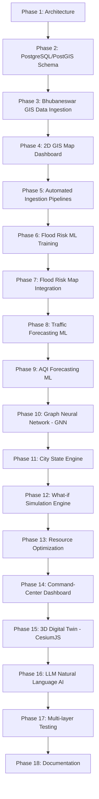

# BBSR Digital Twin — Implementation Roadmap

This document outlines the sequential phases of development. Every phase relies on the preceding ones. We will build, test, and verify each phase before moving forward.

---

---

## Detailed Phases

### Phase 1: Repository and Architecture (COMPLETE)
*   **Goal**: Setup folders, basic configurations, docker infrastructure, and base roadmap.
*   **Success Criteria**: All folders created, docker compose parses successfully, roadmap approved.

### Phase 2: PostgreSQL + PostGIS Schema Design (COMPLETE)
*   **Goal**: Create tables for administrative wards, OSM infrastructure, environmental readings, and ML predictions.
*   **Success Criteria**: SQL schema files written, spatial indexes created, migrations tested.

### Phase 3: Bhubaneswar GIS Ingestion (Current)
*   **Goal**: Automate downloading and validation of GIS data (Wards, Roads, POIs).
*   **Success Criteria**: Validated geometry inside PostGIS, zero duplicate errors, correct projection (EPSG:4326/32645).

### Phase 4: 2D Interactive Map
*   **Goal**: Render Bhubaneswar wards, roads, and POIs in a Next.js + MapLibre GL JS frontend.
*   **Success Criteria**: User can pan, zoom, click on wards, and see real metadata from PostGIS database.

### Phase 5: Reusable ETL Pipelines
*   **Goal**: Standardize ingestion pipelines (Weather, Air Quality, Population, NDVI).
*   **Success Criteria**: Logging for run times, records, and failures. Auto-ingests hourly/daily updates.

### Phase 6: First ML Problem — Flood Risk Modeling
*   **Goal**: Predict pluvial flood susceptibility using terrain (DEM), proximity to water, and land cover.
*   **Success Criteria**: XGBoost, Random Forest, and baseline models logged in MLflow with spatial train/test splits. Explainability computed via SHAP.

### Phase 7: Flood Risk Prediction Map
*   **Goal**: Run inference across grid cells and display LOW/MED/HIGH/VERY HIGH risks on the 2D map.
*   **Success Criteria**: Interactive cells display risk probabilities and SHAP feature importance on click.

### Phase 8: Traffic Forecasting
*   **Goal**: Use historical traffic profiles to predict road segment speeds.
*   **Success Criteria**: Regression models evaluating MAE and RMSE, avoiding lookahead data leakage.

### Phase 9: Air Quality Forecasting
*   **Goal**: Time-series forecasting for PM2.5/PM10.
*   **Success Criteria**: 6-hour, 12-hour, and 24-hour predictions using LSTM or XGBoost models.

### Phase 10: Graph Neural Network (GNN)
*   **Goal**: Translate road intersections into nodes and roads into edges for traffic forecasting.
*   **Success Criteria**: PyTorch Geometric implementation compared with non-graph traffic baselines.

### Phase 11: Unified City State Engine
*   **Goal**: Formulate a time-versioned `CityState` object representing all indicators at time $t$.
*   **Success Criteria**: Immutable database snapshots allowing retrieval of historic and current states.

### Phase 12: Simulation Engine
*   **Goal**: Run "what-if" scenarios (e.g., "increase rainfall by 50%", "close road segment X").
*   **Success Criteria**: Trigger ML inferences dynamically and output delta differences (e.g., changes in hospital access).

### Phase 13: Resource Optimization
*   **Goal**: Solve shelter, ambulance, or supply distribution constraints using Google OR-Tools.
*   **Success Criteria**: Allocates resources to minimize response time based on predicted risk.

### Phase 14: Command-Center Dashboard
*   **Goal**: Build a polished, premium Next.js dashboard showing traffic, flooding, and simulation tabs.
*   **Success Criteria**: Professional visual styling, micro-animations, no placeholders.

### Phase 15: 3D GIS Integration
*   **Goal**: Render 3D terrain, building blocks, and flood risk grids using CesiumJS.
*   **Success Criteria**: Dynamic toggle between 2D and 3D views using the same unified backend API.

### Phase 16: Natural Language AI Interface
*   **Goal**: Add an LLM assistant using tool-calling to run simulations, compare traffic, and fetch risks.
*   **Success Criteria**: The LLM queries the database and ML APIs instead of fabricating numbers.

### Phase 17: Comprehensive Testing
*   **Goal**: Unit, integration, and ML data-leakage testing.
*   **Success Criteria**: All tests pass in the CI/CD pipeline.

### Phase 18: Documentation
*   **Goal**: Finalize architecture guides, ML model manuals, API documentation, and deployment guides.
*   **Success Criteria**: Fully documented codebase ready for research publication or field deployment.
