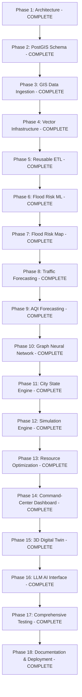

# BBSR Digital Twin — Implementation Roadmap

This document outlines the 18 sequential phases of development for the **Bhubaneswar Digital Twin** project.

---

---

## Detailed Implementation Phases

### 1. Repository and Architecture (COMPLETE)
* **Goal**: Setup modular folder layout, Pydantic configuration, logging, Docker environment, and architecture blueprint.
* **Status**: **COMPLETE**

### 2. PostgreSQL + PostGIS Schema Design (COMPLETE)
* **Goal**: Define PostGIS spatial schemas for administrative wards, road linestrings, building footprints, healthcare facilities, spatial grid cells, and ML predictions.
* **Status**: **COMPLETE**

### 3. Bhubaneswar GIS Data Ingestion (COMPLETE)
* **Goal**: Ingest validated WGS84 (EPSG:4326) spatial vector geometries for Bhubaneswar Municipal Corporation (BMC) boundaries and infrastructure.
* **Status**: **COMPLETE**

### 4. Vector Infrastructure Ingestion (COMPLETE)
* **Goal**: Ingest road networks, public transit routes/stops, water bodies, schools, police stations, and healthcare facilities.
* **Status**: **COMPLETE**

### 5. Reusable ETL Pipelines (COMPLETE)
* **Goal**: Standardized ETL ingestion pipelines for weather (OpenMeteo), satellite remote sensing (Sentinel-2 NDWI), and environmental observations.
* **Status**: **COMPLETE**

### 6. Flood Risk Modeling (COMPLETE)
* **Goal**: Pluvial flood risk machine learning classifier trained on DEM elevation, slope, and Sentinel-2 NDWI with spatial block cross-validation and SHAP explainability.
* **Status**: **COMPLETE**

### 7. Flood Risk Prediction Map (COMPLETE)
* **Goal**: Render spatial grid cells on interactive maps with flood risk probabilities, cell level classifications (`LOW`, `MEDIUM`, `HIGH`, `VERY HIGH`), and SHAP attributions.
* **Status**: **COMPLETE**

### 8. Traffic Forecasting (COMPLETE)
* **Goal**: Multi-step spatio-temporal road segment traffic speed forecaster with strict chronological splitters avoiding lookahead data leakage.
* **Status**: **COMPLETE**

### 9. Air Quality Forecasting (COMPLETE)
* **Goal**: Multi-pollutant forecaster predicting ambient $PM_{2.5}$ concentrations and AQI sub-indices across municipal monitoring stations.
* **Status**: **COMPLETE**

### 10. Graph Neural Network (GNN) Traffic Forecasting (COMPLETE)
* **Goal**: PyTorch Spatio-Temporal Graph Neural Network (ST-GNN) operating over road network graph topology for network-wide speed propagation modeling.
* **Status**: **COMPLETE**

### 11. Unified City State Engine (COMPLETE)
* **Goal**: Time-versioned `CityState` representation providing canonical multi-domain urban indicator aggregation across wards and spatial grid cells.
* **Status**: **COMPLETE**

### 12. What-If Simulation Engine (COMPLETE)
* **Goal**: Formal scenario engine executing counterfactual simulations (Heavy Rainfall, Road Closures, Air Pollution, Emergency Demand) while maintaining 100% base-state immutability.
* **Status**: **COMPLETE**

### 13. Emergency Resource Optimization (COMPLETE)
* **Goal**: Google OR-Tools min-cost flow solver allocating capacitated emergency facilities (hospitals, rescue teams) to affected demand locations under simulated stress.
* **Status**: **COMPLETE**

### 14. Command-Center Dashboard (COMPLETE)
* **Goal**: React + TypeScript command-center web app with Leaflet 2D GIS visualization, live city KPI cards, scenario triggers, and Spatial Inspector.
* **Status**: **COMPLETE**

### 15. 3D GIS Integration (COMPLETE)
* **Goal**: CesiumJS 3D visualization rendering 3D terrain, extruded 3D building geometries, 3D flood risk planes, AQI visualizers, and emergency allocation arcs.
* **Status**: **COMPLETE**

### 16. Natural Language AI Interface (COMPLETE)
* **Goal**: Intent classification and tool orchestration over a controlled tool registry (`TOOL_REGISTRY`), turning natural language queries into verified map actions and API queries.
* **Status**: **COMPLETE**

### 17. Comprehensive Testing (COMPLETE)
* **Goal**: 5-tier testing hierarchy (Backend Units, PostGIS GIS, ETL Pipelines, ML/GNN Determinism, E2E Scenarios) verifying system integrity with 163 pytest backend tests and 14 vitest frontend tests passing.
* **Status**: **COMPLETE**

### 18. Documentation & Deployment (COMPLETE)
* **Goal**: Complete system architecture docs, setup manual, configuration specification, REST API reference, demonstration script, model cards, data provenance, Docker containerization, operations guide, clean-install validation, and production build verification.
* **Status**: **COMPLETE**

---

> 🎉 **All planned Bhubaneswar Digital Twin roadmap phases are complete.**
