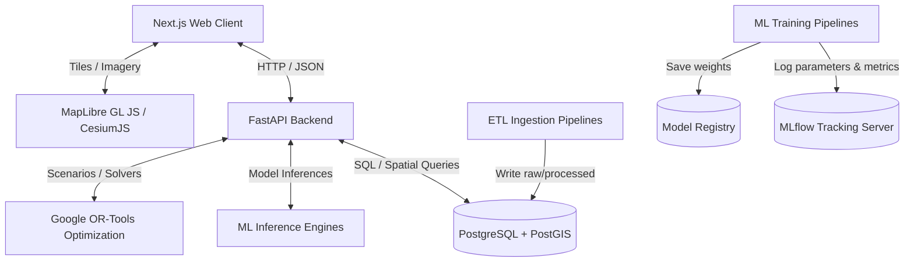

# BBSR Digital Twin — Architecture Documentation

This document describes the architectural layout, technology integrations, and data flow of the Bhubaneswar Digital Twin.

---

## 🏛️ System Component Topology

The system is organized as a multi-container stack, ensuring clean separation of concerns, scalability, and modularity.



---

## 💻 1. Frontend Architecture (`/frontend`)

The frontend acts as the Command-Center interface (Phase 14) and 3D terrain viewer (Phase 15).

*   **Framework**: Next.js (App Router) + TypeScript + Tailwind CSS.
*   **State Management**: **Zustand** is used for global application states, such as selected layers, active time step $t$, simulation parameters, and active ward metrics.
*   **GIS Engine**:
    *   **2D GIS**: **MapLibre GL JS** maps vector tiles (wards, roads, water bodies) and points of interest. It interacts directly with GeoJSON responses from the FastAPI backend.
    *   **3D GIS**: **CesiumJS** maps 3D terrain grids and extrudes building models based on floor heights stored in the database.
*   **Charts & Visualizations**: **Recharts** displays time-series data for weather forecasts, air quality indices, traffic speeds, and model feature importances.
*   **UI Components**: **shadcn/ui** (based on Radix UI primitives) ensures a premium look and feel with dark-mode optimizations, fluid hover states, and responsive grids.

---

## ⚙️ 2. Backend Architecture (`/backend`)

The backend is a RESTful API and execution engine.

*   **Web Framework**: **FastAPI** provides fast asynchronous endpoints for map querying, simulation triggers, and LLM orchestration.
*   **Data Models**: **Pydantic** enforces static typing and validation on all data payloads (e.g., simulation configurations, point coordinate bounds).
*   **Database Client**: **SQLAlchemy** (async) or **GeoAlchemy2** for handling spatial queries and interacting with PostGIS geometries.
*   **Core Engines**:
    *   **Simulation Engine**: Translates user inputs (e.g., "rainfall + 30%") into updated environment arrays, runs ML prediction wrappers, computes downstream metrics, and returns Delta states.
    *   **Optimization Engine**: Packages active risk estimates into linear programs and calls **Google OR-Tools** to return optimal resource locations.

### Request Flow Pattern
The typical flow of a spatial data query in Phase 2 runs as follows:
```text
User Action (Click Ward)
   ↓
Frontend (Zustand state triggers fetch /api/v1/wards/42)
   ↓
FastAPI Router (Interprets endpoint, calls get_db Session dependency)
   ↓
SQLAlchemy ORM (Translates Python DB query to SQL with spatial projections)
   ↓
PostgreSQL + PostGIS (Executes query, extracts geometry and attributes)
   ↓
GeoJSON Serializer (FastAPI serializes PostGIS WKB to standard GeoJSON Feature)
   ↓
Frontend Map (MapLibre GL JS renders the GeoJSON polygon on the map)
```


---

## 🗄️ 3. Database Layer (`/database`)

PostgreSQL serves as the spatial data hub.

*   **Spatial Extension**: **PostGIS** allows geometry indexing and native execution of spatial operations (intersection, buffer, distance).
*   **Key Schemas**:
    *   `city_boundary` & `wards`: Administrative polygon structures.
    *   `roads` & `intersections`: Intersecting network topology.
    *   `spatial_grid_cells`: Uniform grids tiling the city for ML flood modeling.
    *   `air_quality_history` & `weather_history`: Relational time-series metrics.
    *   `model_predictions` & `simulations`: Inferred metrics linked back to spatial cells.

---

## 🧠 4. Machine Learning & Pipelines (`/ml`, `/pipelines`)

The intelligence layers run asynchronously or as microservices.

*   **Pipelines (ETL)**: Python scripts that download, validate (CRS, geometry checks), clean, and save datasets.
*   **Model Training**:
    *   **Flood Risk (Spatial)**: Tabular modeling (XGBoost/Random Forest) trained on geographic grid cells. Evaluated using spatial validation folds to prevent geographical leakage.
    *   **Traffic (Time-series & Graph)**: LSTMs and Graph Neural Networks (GNNs via PyTorch Geometric) forecasting road congestion coefficients.
    *   **Air Quality (Time-series)**: Classical baselines compared with XGBoost regressor models forecasting hourly values.
*   **Experiment Tracking**: **MLflow** tracks parameters (learning rates, estimators), metrics (F1, MAE, RMSE), and registers trained model artifacts.
