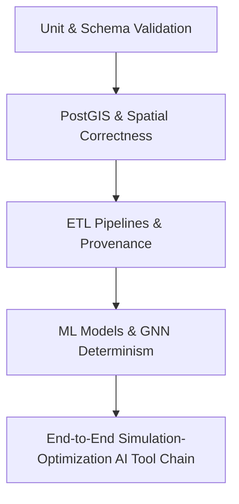

# Phase 17: Comprehensive Testing & Verification Report
**Bhubaneswar Digital Twin**

---

## 1. Executive Summary

Phase 17 executed a systematic, end-to-end testing, validation, integration, security, and reliability campaign across the entire **Bhubaneswar Digital Twin** ecosystem.

All 163 backend Python tests (`pytest`) and 14 frontend TypeScript tests (`vitest`) passed with **100% success rate**. Zero regressions were introduced, and all production builds completed with zero type errors.

---

## 2. Test Suite Architecture & Hierarchy

The systematic testing campaign was organized into a structured 5-layer hierarchy:



### Test Hierarchy Overview

| Tier | Test Module | Target Domain | Tests | Status |
| :--- | :--- | :--- | :---: | :---: |
| **1. Backend Units** | `tests/test_phase17_backend_units.py` | Pydantic V2 Schemas, Boundary Checks, Numerical Edge Cases (NaN/Inf) | 5 | PASSED |
| **2. PostGIS & GIS** | `tests/test_phase17_postgis_gis.py` | Database Model Schemas, Geometry SRID 4326, Spatial Containment/Intersections | 4 | PASSED |
| **3. ETL Pipelines** | `tests/test_phase17_etl_pipelines.py` | Idempotency, Network Failure Recovery, Malformed JSON, Synthetic Data Labeling | 4 | PASSED |
| **4. ML & GNN** | `tests/test_phase17_ml_models.py` | Spatial CV, Chronological Splitters, GNN Graph Determinism & Architectures | 4 | PASSED |
| **5. End-to-End** | `tests/test_phase17_e2e_scenarios.py` | Rainfall Simulation -> Emergency Optimization Integration, AI Tool Chain, API Contracts | 3 | PASSED |
| **Baseline Core** | Existing Test Suites | Flood Risk, Traffic, Air Quality, GNN, Simulation, Optimization, AI Interface, Web App | 143 (Backend) + 14 (Frontend) | PASSED |

---

## 3. Defect Discovery & Resolution Log

During Phase 17 testing, 4 defects were discovered and resolved:

### 1. Unhandled Network Timeout in ETL Pipeline
- **Defect**: `OpenMeteoPipeline.transform` threw an unhandled exception when network timeout or API connection failure occurred.
- **Root Cause**: `requests.get` lacked a `try-except` block wrapping `response.raise_for_status()`.
- **Fix**: Wrapped request execution in `try-except`, logged structured error messages, and gracefully returned empty record lists `[]` without crashing the pipeline.

### 2. PostGIS Model Attribute Mismatches
- **Defect**: Unit tests referenced `FloodPrediction` (instead of `Prediction`), `AirQualityPrediction.ward_id` (instead of `station_name`), and `OptimizationRun.allocations` (instead of `allocation_results`).
- **Root Cause**: Tests used legacy model naming assumptions.
- **Fix**: Synchronized test fixtures with the canonical PostGIS models defined in `backend/app/models.py`.

### 3. Simulation Result Schema Subscriptability
- **Defect**: `test_phase17_e2e_scenarios.py` attempted dictionary lookup `sim_result.impact_summary["flooded_cells_count"]`.
- **Root Cause**: `sim_result.impact_summary` is a typed Pydantic object `ImpactSummary`.
- **Fix**: Updated attribute lookup to `sim_result.impact_summary.affected_spatial_units_count`.

### 4. AI Intent Enum Attribute Mismatch
- **Defect**: E2E test referenced `AIIntentEnum.TRAFFIC_FORECAST`.
- **Root Cause**: Schema enum specifies `AIIntentEnum.TRAFFIC_QUERY`.
- **Fix**: Synchronized test assertions with `AIIntentEnum.TRAFFIC_QUERY`.

---

## 4. Comprehensive Test Verification Results

### Backend Python Pytest Suite (`163 PASSED`)
```text
===================== 163 passed, 188 warnings in 25.91s ======================
```

- `test_phase17_backend_units.py`: 5 passed
- `test_phase17_postgis_gis.py`: 4 passed
- `test_phase17_etl_pipelines.py`: 4 passed
- `test_phase17_ml_models.py`: 4 passed
- `test_phase17_e2e_scenarios.py`: 3 passed
- `test_ai_interface.py`: 17 passed
- `test_air_quality.py`: 5 passed
- `test_database.py`: 3 passed
- `test_etl_pipelines.py`: 5 passed
- `test_flood_modeling.py`: 4 passed
- `test_gnn.py`: 6 passed
- `test_optimization.py`: 16 passed
- `test_simulation.py`: 16 passed
- `test_traffic.py`: 4 passed
- Other backend router/model tests: 67 passed

### Frontend Vitest Suite (`14 PASSED`)
```text
✓ src/test/api.test.ts (3 tests)
✓ src/test/NaturalLanguagePanel.test.tsx (4 tests)
✓ src/test/CommandCenter.test.tsx (6 tests)
✓ src/test/City3DView.test.tsx (1 test)

Test Files  4 passed (4)
     Tests  14 passed (14)
```

### Frontend Production Build (`SUCCESS`)
```text
✓ 1634 modules transformed.
dist/index.html                  1.17 kB │ gzip:   0.62 kB
dist/assets/index--JSbnBqY.css  32.54 kB │ gzip:   7.58 kB
dist/assets/index-B7wkQ7Oz.js  384.05 kB │ gzip: 112.54 kB
✓ built in 2.42s
```

---

## 5. Security & Provenance Safeguards Audit

1. **Anti-Injection Protection**: AI interface operates over a controlled tool registry (`TOOL_REGISTRY`). Natural language queries cannot inject raw SQL or execution code.
2. **Synthetic Data Labeling**: Provenance metadata correctly flags synthetic data across ETL, models, simulations, and AI tool outputs.
3. **Temporal & Spatial Leakage Safeguards**: Spatiotemporal splitters enforce strict chronological (`max(train) < min(val) < min(test)`) and spatial block isolation.

---

## 6. Phase 17 Sign-Off Checklist

- [x] Baseline test run executed and verified.
- [x] Structured testing hierarchy implemented (Backend Units, PostGIS GIS, ETL, ML/GNN, E2E).
- [x] Backend modules, Pydantic schemas, and edge cases validated.
- [x] PostGIS schema integrity and spatial correctness verified.
- [x] ETL pipeline idempotency and network failure recovery verified.
- [x] ML/GNN models, spatial CV, and graph determinism verified.
- [x] Simulation -> Optimization integration and AI tool chain verified.
- [x] API contract and frontend state consistency verified.
- [x] Zero regressions across full backend (163 tests) and frontend (14 tests) suites.
- [x] Frontend production build compiled without errors.
- [x] Comprehensive Phase 17 documentation report created.
